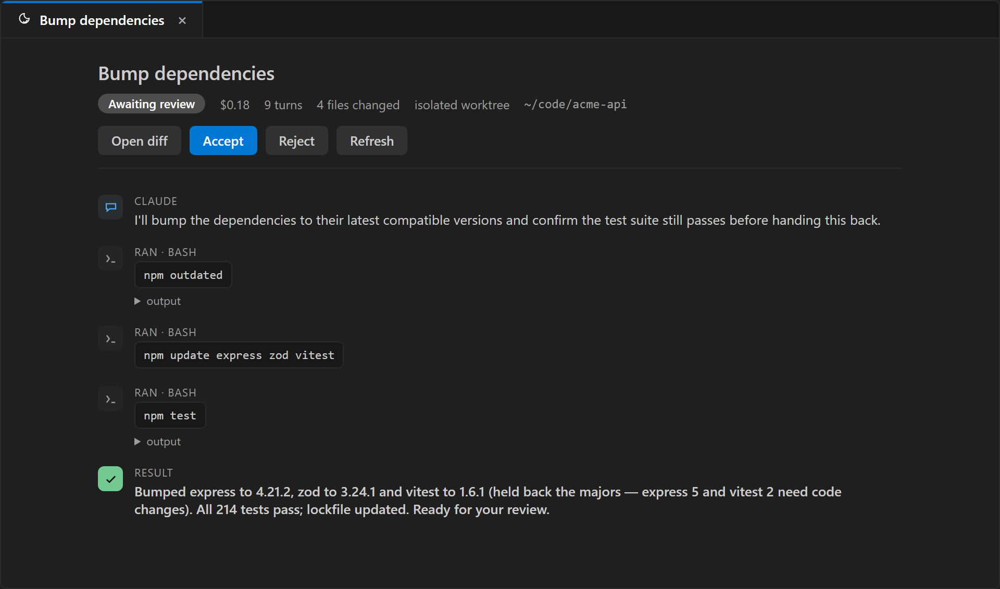
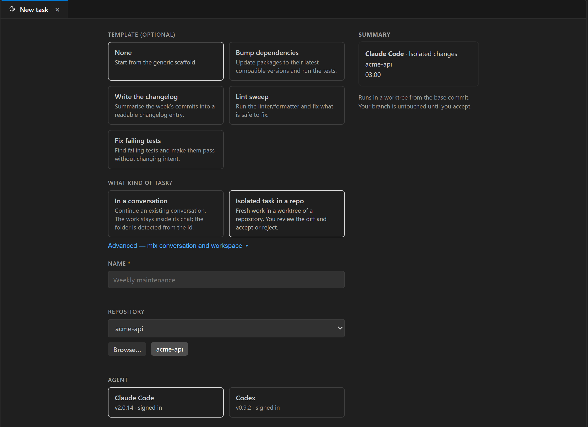
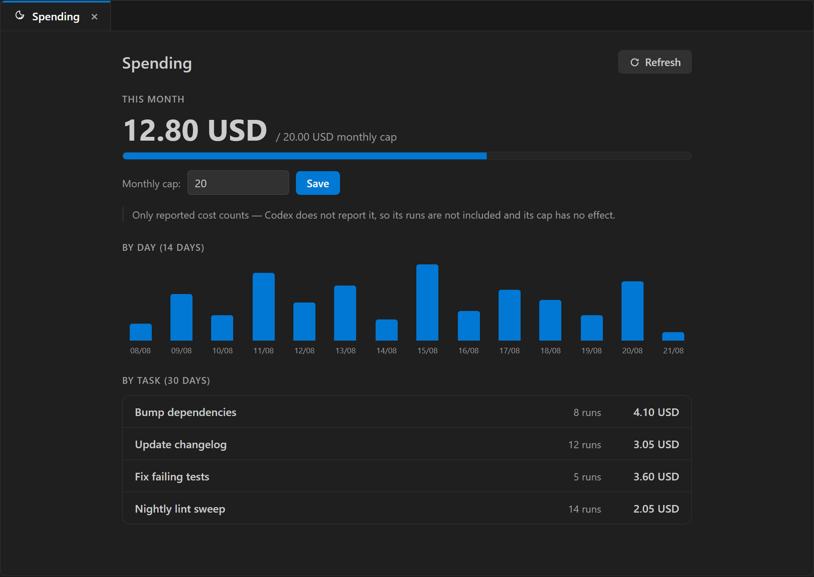

# TaskKeeper

**Your coding agents work the night shift without touching your repository. In the morning you review the diff and decide.**

TaskKeeper runs [Claude Code](https://code.claude.com) or [Codex](https://developers.openai.com/codex) on a schedule, **inside an isolated Git worktree**, and puts the result in a review inbox: the files it changed, what it cost, and two buttons — accept into your branch, or discard.

Scheduling prompts is something several tools already do, including the agents themselves. What none of them do is keep the agent's work **isolated and reviewable**. Every other scheduler runs the agent on your working directory; if it gets something wrong at 3 a.m., it gets it wrong on your code.

> Free, local-first, no telemetry, no account. Not affiliated with Anthropic or OpenAI.

## What you get

| | |
|---|---|
| **Isolated worktree per run** | The agent works on a copy created from the exact base commit. Your checkout is never touched. |
| **The morning inbox** | Each finished run shows its diff (VS Code's own diff editor), the files it changed and its cost. Accept merges locally — never pushes. Reject deletes the worktree and branch, leaving nothing behind. |
| **A morning digest that catches silent failure** | The *Last night* view sums up what ran while you were away — finished, waiting for review, failed, skipped, cost — and flags the failure mode schedulers usually hide: if a task's OS trigger got unregistered, it turns red ("trigger missing") instead of quietly never running again. |
| **Runs with VS Code closed** | Schedules are registered with the operating system's own scheduler (**Windows Task Scheduler / macOS launchd**). No background daemon of ours; if your machine is on, the task runs — and on Windows it can wake the machine. |
| **Templates to start from** | Common tasks — bump dependencies, write the changelog, lint sweep, fix failing tests — preload the name, prompt, permissions, mode and schedule in one click. Tasks that change code default to isolated (reviewable); read-only stays read-only. |
| **Chain a task after another** | A task can run *after* another finishes — on success, on failure, or either way — for a natural build-then-verify or fix-then-recheck flow. Cycles are rejected. |
| **Resume or fork a conversation** | A task can start fresh, continue an existing Claude Code conversation, or fork it — or run *in the conversation* (in the real repo, appending its turns to a chat you pick) for recurring read-only checks. |
| **Claude Code and Codex, one model of safety** | Two permission profiles — *audit (read only)* and *isolated changes* — applied explicitly on every run through a controlled settings profile your personal Claude config cannot widen. TaskKeeper does not rely on the agent's defaults: it measured them and they were too permissive. |
| **Spend in view, with a monthly cap** | A cap per run *and* a monthly ceiling the runner itself enforces — once the month hits the cap, the next task is skipped before it spends. A *Spend* panel breaks the month down by day and by task. (Cost is reported by Claude; Codex spend isn't metered — the panel says so.) |
| **A record of everything** | Which agent, which repository and commit, which permissions, what it changed, what it cost, who accepted it. Secrets that look like tokens are redacted from stored logs. |

## Getting started

1. Install the extension. Have Claude Code and/or Codex installed in VS Code and signed in.
2. Open the **TaskKeeper** view in the Activity Bar → **New task**. The panel opens on the intent — *in a conversation* or *isolated task in a repo* — and fills in the rest for you; an **Advanced** link exposes every field. Or pick a **template** to preload a common task. A four-step interactive tutorial (ES/EN) runs the first time.
3. Choose **Create and run now** to test it immediately. Watch the **Last night** view; when it finishes, open the diff and accept or reject.

The prompt matters more than the schedule. TaskKeeper pre-fills a durable structure: goal, what is allowed, what is not, how to report. Edit it any time — earlier runs keep the version they used.

## Screenshots

<!-- SHOTS: hero = morning inbox with a diff + accept/reject. Add under media/shots/ and reference here. -->
<!--  -->
<!--  -->
<!--  -->
<!--  -->

_Screenshots and a short demo GIF land in the next update._

## How it works

- Each task is one entry in the OS scheduler, under its own folder (`Argalla\TaskKeeper`). TaskKeeper never touches any other scheduled task.
- At the scheduled time a short-lived worker starts, takes a machine-wide "slot" (one concurrent run by default), creates a worktree from the base commit, launches the agent with an explicit permission profile inside a Windows Job Object (so cancelling kills every descendant process), and records events, cost and outcome in a local SQLite database.
- The extension only reads that database (through the bundled `taskkeeper-ctl`) and refreshes in well under a second when the worker touches a marker file. No polling, no daemon.
- Missed runs follow the policy you chose per task: skip, run if less than *n* hours late, or wait for you.

## Requirements and limitations (read this)

- **Windows 10/11 (x64)** and **macOS (Apple Silicon + Intel)**. Windows has shipped since the first release; macOS just landed — its binaries are **signed with a Developer ID** and the extension clears the quarantine flag on install, so they open without Gatekeeper prompts. macOS is fresh on real hardware — reports welcome. (Linux isn't packaged yet.)
- The machine must be **on and your session signed in** at the scheduled time. Task Scheduler can wake a sleeping PC if *wake timers* are allowed in your power plan — on battery they usually are not; TaskKeeper tells you when it creates the task. On macOS, a scheduled run needs you logged in (launchd *Aqua* session).
- The agent CLI must be **already signed in**. A scheduled run has no terminal to answer a login or a "trust this folder?" prompt; TaskKeeper detects both and fails fast with a clear reason instead of hanging.
- Your usage of Claude Code / Codex is subject to their terms. TaskKeeper does not store or transmit your credentials; it launches the same binaries you use by hand.

## Privacy

Everything stays on your machine: tasks, prompts, transcripts of runs, worktrees. There is no telemetry, no account, no network call from TaskKeeper itself. Secrets that look like tokens or keys are redacted from stored logs.

## Support

Issues and questions: <https://github.com/TecniartGalicia/taskkeeper/issues>. Made by [Argalla](https://argalla.com) (Tecniart Galicia, S.L.), Galicia, Spain.
